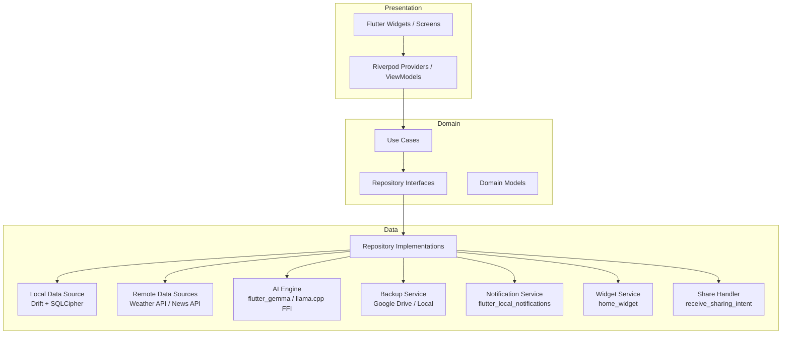

# Design Document: Everything App

## Overview

Everything App is an offline-first, all-in-one productivity app for Android and iOS built with Flutter (Dart). It consolidates task management, personal knowledge management, finance tracking, AI assistance, notifications, home screen widgets, and theming into a single application.

The app is structured around four core modules (Dashboard, Tasks, Library, Finance), a floating AI assistant powered by an on-device language model, and system-level integrations (share extension, home screen widgets, push notifications). All data is stored locally in an AES-256 encrypted SQLite database (Drift + SQLCipher), with optional sync to Google Drive.

Key design goals:
- **Offline-first**: All CRUD operations work without internet. Online-only features (weather, news) degrade gracefully.
- **Security**: AES-256 database encryption at rest; biometric + PIN auth; vault items re-encrypted at the item level.
- **Performance**: < 2s cold launch, < 200ms task creation, < 300ms global search over 10,000 items.
- **Extensibility**: Clean layered architecture (Data → Domain → Presentation) with Riverpod for dependency injection and state management.

---

## Architecture

### High-Level Diagram



### Architecture Principles

- **Layered (Clean) Architecture**: Presentation → Domain → Data. Dependencies point inward only.
- **Riverpod** for all dependency injection and reactive state management.
- **go_router** for declarative navigation with deep-link support.
- **Repository Pattern**: Domain layer defines abstract repository interfaces; Data layer provides implementations backed by Drift.
- **Offline-first**: All writes go to Drift first. The Sync service propagates changes to remote when connectivity is restored.

---

## Flutter Project Structure

```
lib/
├── main.dart
├── app/
│   ├── app.dart                    # MaterialApp + Riverpod ProviderScope
│   ├── router.dart                 # go_router configuration
│   └── theme/
│       ├── app_theme.dart          # Material 3 ThemeData factory
│       └── theme_provider.dart     # Riverpod provider for current theme
│
├── core/
│   ├── constants/
│   ├── errors/
│   │   ├── app_exception.dart
│   │   └── failure.dart
│   ├── extensions/
│   ├── utils/
│   │   ├── date_utils.dart
│   │   └── encryption_utils.dart   # AES-256 helpers (encrypt package)
│   └── widgets/                    # Shared UI components
│
├── data/
│   ├── database/
│   │   ├── app_database.dart       # Drift AppDatabase definition
│   │   ├── tables/                 # One file per Drift table
│   │   │   ├── tasks_table.dart
│   │   │   ├── library_table.dart
│   │   │   ├── finance_table.dart
│   │   │   └── ...
│   │   └── daos/                   # Data Access Objects
│   │       ├── tasks_dao.dart
│   │       ├── library_dao.dart
│   │       ├── finance_dao.dart
│   │       └── ...
│   ├── repositories/               # Implementations of domain interfaces
│   │   ├── tasks_repository_impl.dart
│   │   ├── library_repository_impl.dart
│   │   ├── finance_repository_impl.dart
│   │   ├── ai_repository_impl.dart
│   │   └── settings_repository_impl.dart
│   ├── datasources/
│   │   ├── remote/
│   │   │   ├── weather_api_datasource.dart
│   │   │   └── news_api_datasource.dart
│   │   └── local/
│   │       └── secure_storage_datasource.dart
│   └── services/
│       ├── notification_service.dart
│       ├── backup_service.dart
│       ├── sync_service.dart
│       ├── widget_service.dart
│       ├── share_service.dart
│       └── security_service.dart
│
├── domain/
│   ├── models/                     # Pure Dart domain models
│   │   ├── task.dart
│   │   ├── transaction.dart
│   │   ├── bookmark.dart
│   │   └── ...
│   ├── repositories/               # Abstract interfaces
│   │   ├── i_tasks_repository.dart
│   │   ├── i_finance_repository.dart
│   │   └── ...
│   └── usecases/
│       ├── tasks/
│       ├── finance/
│       ├── library/
│       └── ai/
│
├── features/
│   ├── auth/
│   │   ├── providers/
│   │   └── screens/
│   ├── dashboard/
│   │   ├── providers/
│   │   └── screens/
│   ├── tasks/
│   │   ├── providers/
│   │   └── screens/
│   ├── library/
│   │   ├── providers/
│   │   └── screens/
│   ├── finance/
│   │   ├── providers/
│   │   └── screens/
│   ├── ai_assistant/
│   │   ├── providers/
│   │   └── widgets/
│   └── settings/
│       ├── providers/
│       └── screens/
│
└── providers/
    └── app_providers.dart          # Root provider overrides
```

---

## Components and Interfaces

### Repository Interfaces (Domain Layer)

```dart
// domain/repositories/i_tasks_repository.dart
abstract class ITasksRepository {
  Future<List<Task>> getTasksForDate(DateTime date);
  Future<List<Task>> searchTasks(String query);
  Future<Task> createTask(Task task);
  Future<Task> updateTask(Task task);
  Future<void> deleteTask(String id);
  Future<List<Task>> getTasksByFilter(TaskFilter filter);
  Stream<List<Task>> watchTasksForDate(DateTime date);
}

// domain/repositories/i_finance_repository.dart
abstract class IFinanceRepository {
  Future<List<Transaction>> getTransactions({DateRange? range});
  Future<Transaction> createTransaction(Transaction tx);
  Future<Transaction> updateTransaction(Transaction tx);
  Future<void> deleteTransaction(String id);
  Future<List<Transaction>> searchTransactions(String query);
  Future<FinanceSummary> getMonthlySummary(int year, int month);
  Future<List<Budget>> getBudgets();
  Future<Budget> upsertBudget(Budget budget);
}

// domain/repositories/i_library_repository.dart
abstract class ILibraryRepository {
  Future<List<Bookmark>> getBookmarks({String? folder});
  Future<Bookmark> saveBookmark(Bookmark bookmark);
  Future<List<WatchlistEntry>> getWatchlist();
  Future<WatchlistEntry> upsertWatchlistEntry(WatchlistEntry entry);
  Future<List<ToBuyItem>> getToBuyItems();
  Future<ToBuyItem> upsertToBuyItem(ToBuyItem item);
  Future<List<Project>> getProjects();
  Future<Project> createProject(Project project);
  Future<VaultItem> saveVaultItem(VaultItem item);
  Future<List<VaultItem>> searchVault(String query);
  Future<List<Document>> getDocuments({String? projectId});
  Future<Document> saveDocument(Document doc);
}

// domain/repositories/i_ai_repository.dart
abstract class IAIRepository {
  Future<ParsedTaskIntent> parseTaskIntent(String input);
  Future<ParsedTransactionIntent> parseTransactionIntent(String input);
  Future<String> summarizeDocument(String documentId);
  Future<List<SearchResult>> searchWithAI(String query);
  Future<String> answerQuestion(String question);
  bool get isModelLoaded;
}

// domain/repositories/i_settings_repository.dart
abstract class ISettingsRepository {
  Future<AppSettings> getSettings();
  Future<void> saveSettings(AppSettings settings);
  Stream<AppSettings> watchSettings();
}
```

### Service Interfaces

```dart
// data/services/notification_service.dart
abstract class INotificationService {
  Future<void> initialize();
  Future<void> scheduleTaskReminder(Task task);
  Future<void> cancelTaskReminder(String taskId);
  Future<void> scheduleDailySummary(TimeOfDay time);
  Future<void> scheduleWeeklySummary(TimeOfDay time);
  Future<void> sendBudgetWarning(Budget budget, double percentage);
}

// data/services/security_service.dart
abstract class ISecurityService {
  Future<bool> authenticate({required AuthReason reason});
  Future<void> setPIN(String pin);
  Future<bool> verifyPIN(String pin);
  Future<String> getDatabaseEncryptionKey();
  bool get isBiometricAvailable;
}

// data/services/backup_service.dart
abstract class IBackupService {
  Future<BackupResult> createBackup({required BackupDestination destination});
  Future<RestoreResult> restoreBackup(String backupPath);
  Future<bool> verifyBackupIntegrity(String backupPath);
}
```

---

## Data Models

```dart
// domain/models/task.dart
class Task {
  final String id;
  final String title;
  final DateTime? dueDate;
  final TaskPriority priority; // low, medium, high, critical
  final TaskStatus status;     // pending, completed, cancelled, overdue
  final String? categoryId;
  final String? projectId;
  final List<SubTask> subtasks;
  final List<String> tags;
  final String? notes;
  final RecurrenceRule? recurrence;
  final List<Reminder> reminders;
  final List<Attachment> attachments;
  final DateTime createdAt;
  final DateTime updatedAt;
}

// domain/models/transaction.dart
class Transaction {
  final String id;
  final String title;
  final double amount;
  final DateTime date;
  final TransactionType type; // income, expense, transfer, investment
  final String category;
  final String accountId;
  final String? notes;
  final List<String> tags;
  final List<Attachment> attachments;
  final DateTime createdAt;
}

// domain/models/bookmark.dart
class Bookmark {
  final String id;
  final String url;
  final String title;
  final String? thumbnailUrl;
  final BookmarkSourceType sourceType; // website, youtube, github, reddit, social
  final List<String> tags;
  final String? folderId;
  final DateTime savedAt;
}

// domain/models/vault_item.dart
class VaultItem {
  final String id;
  final VaultItemType type; // password, document, bankDetail, id, license, card
  final String name;
  final String encryptedPayload; // AES-256 encrypted JSON
  final String? folderId;
  final DateTime createdAt;
  final DateTime updatedAt;
}

// domain/models/finance_summary.dart
class FinanceSummary {
  final double totalIncome;
  final double totalExpenses;
  final double savings;
  final double budgetRemaining;
  final Map<String, double> expensesByCategory;
}

// domain/models/budget.dart
class Budget {
  final String id;
  final double monthlyLimit;
  final Map<String, double> categoryLimits; // category -> limit
  final int month;
  final int year;
}

// domain/models/watchlist_entry.dart
class WatchlistEntry {
  final String id;
  final String title;
  final MediaType mediaType; // movie, tvShow, anime, manga, book, game
  final WatchStatus status;  // watching, completed, dropped, wishlist
  final double? rating;
  final int? currentProgress;
  final int? totalEpisodes;
  final int? totalChapters;
  final DateTime? completedAt;
}

// domain/models/app_settings.dart
class AppSettings {
  final AppTheme theme;        // dark, light, amoled, system
  final String accentColor;   // hex color string
  final FontSize fontSize;    // small, medium, large
  final bool biometricEnabled;
  final bool autoLockEnabled;
  final Duration autoLockDuration;
  final NotificationSettings notifications;
  final BackupSettings backup;
  final AISettings ai;
  final bool hideSensitiveData;
}
```

---

## Database Schema (Drift Table Definitions)

```dart
// data/database/tables/tasks_table.dart
@DataClassName('TaskEntry')
class TasksTable extends Table {
  TextColumn get id => text()();
  TextColumn get title => text()();
  DateTimeColumn get dueDate => dateTime().nullable()();
  TextColumn get priority => text().withDefault(const Constant('medium'))();
  TextColumn get status => text().withDefault(const Constant('pending'))();
  TextColumn get categoryId => text().nullable()();
  TextColumn get projectId => text().nullable()();
  TextColumn get notes => text().nullable()();
  TextColumn get recurrenceJson => text().nullable()();
  TextColumn get tagsJson => text().withDefault(const Constant('[]'))();
  TextColumn get remindersJson => text().withDefault(const Constant('[]'))();
  TextColumn get subtasksJson => text().withDefault(const Constant('[]'))();
  DateTimeColumn get createdAt => dateTime()();
  DateTimeColumn get updatedAt => dateTime()();

  @override
  Set<Column> get primaryKey => {id};
}

// data/database/tables/transactions_table.dart
@DataClassName('TransactionEntry')
class TransactionsTable extends Table {
  TextColumn get id => text()();
  TextColumn get title => text()();
  RealColumn get amount => real()();
  DateTimeColumn get date => dateTime()();
  TextColumn get type => text()();      // income | expense | transfer | investment
  TextColumn get category => text()();
  TextColumn get accountId => text()();
  TextColumn get notes => text().nullable()();
  TextColumn get tagsJson => text().withDefault(const Constant('[]'))();
  DateTimeColumn get createdAt => dateTime()();

  @override
  Set<Column> get primaryKey => {id};
}

// data/database/tables/bookmarks_table.dart
@DataClassName('BookmarkEntry')
class BookmarksTable extends Table {
  TextColumn get id => text()();
  TextColumn get url => text()();
  TextColumn get title => text()();
  TextColumn get thumbnailUrl => text().nullable()();
  TextColumn get sourceType => text()();
  TextColumn get tagsJson => text().withDefault(const Constant('[]'))();
  TextColumn get folderId => text().nullable()();
  DateTimeColumn get savedAt => dateTime()();

  @override
  Set<Column> get primaryKey => {id};
}

// data/database/tables/vault_items_table.dart
@DataClassName('VaultItemEntry')
class VaultItemsTable extends Table {
  TextColumn get id => text()();
  TextColumn get type => text()();
  TextColumn get name => text()();
  TextColumn get encryptedPayload => text()();
  TextColumn get folderId => text().nullable()();
  DateTimeColumn get createdAt => dateTime()();
  DateTimeColumn get updatedAt => dateTime()();

  @override
  Set<Column> get primaryKey => {id};
}

// data/database/tables/budgets_table.dart
@DataClassName('BudgetEntry')
class BudgetsTable extends Table {
  TextColumn get id => text()();
  RealColumn get monthlyLimit => real()();
  TextColumn get categoryLimitsJson => text().withDefault(const Constant('{}'))();
  IntColumn get month => integer()();
  IntColumn get year => integer()();

  @override
  Set<Column> get primaryKey => {id};
}

// data/database/tables/watchlist_table.dart
@DataClassName('WatchlistEntry')
class WatchlistTable extends Table {
  TextColumn get id => text()();
  TextColumn get title => text()();
  TextColumn get mediaType => text()();
  TextColumn get status => text()();
  RealColumn get rating => real().nullable()();
  IntColumn get currentProgress => integer().nullable()();
  IntColumn get totalEpisodes => integer().nullable()();
  IntColumn get totalChapters => integer().nullable()();
  DateTimeColumn get completedAt => dateTime().nullable()();

  @override
  Set<Column> get primaryKey => {id};
}

// data/database/tables/documents_table.dart
@DataClassName('DocumentEntry')
class DocumentsTable extends Table {
  TextColumn get id => text()();
  TextColumn get title => text()();
  TextColumn get contentJson => text()(); // Delta/Quill-like rich text JSON
  TextColumn get projectId => text().nullable()();
  TextColumn get revisionsJson => text().withDefault(const Constant('[]'))();
  DateTimeColumn get createdAt => dateTime()();
  DateTimeColumn get updatedAt => dateTime()();
  DateTimeColumn get lastAutoSavedAt => dateTime().nullable()();

  @override
  Set<Column> get primaryKey => {id};
}

// data/database/app_database.dart (excerpt)
@DriftDatabase(tables: [
  TasksTable,
  TransactionsTable,
  BookmarksTable,
  VaultItemsTable,
  BudgetsTable,
  WatchlistTable,
  DocumentsTable,
  // + categories, accounts, projects, to_buy_items, settings...
])
class AppDatabase extends _$AppDatabase {
  AppDatabase(QueryExecutor e) : super(e);

  @override
  int get schemaVersion => 1;

  static QueryExecutor openConnection(String encryptionKey) {
    return LazyDatabase(() async {
      final dbDir = await getApplicationDocumentsDirectory();
      final file = File(path.join(dbDir.path, 'everything.db'));
      return NativeDatabase.createInBackground(
        file,
        setup: (db) {
          // SQLCipher: set encryption key
          db.execute("PRAGMA key = '$encryptionKey';");
        },
      );
    });
  }
}
```

---

## Correctness Properties

*A property is a characteristic or behavior that should hold true across all valid executions of a system — essentially, a formal statement about what the system should do. Properties serve as the bridge between human-readable specifications and machine-verifiable correctness guarantees.*

### Property 1: Task Creation Round-Trip

*For any* valid Task object, creating it via the repository and then reading it back by its ID should return a task with equivalent fields (title, dueDate, priority, status, tags, subtasks).

**Validates: Requirements 4.4, 4.5, 21.1**

---

### Property 2: Empty and Whitespace-Only Task Titles Are Rejected

*For any* string composed entirely of whitespace characters (including the empty string), attempting to create a Task with that title should fail with a validation error and the task list should remain unchanged.

**Validates: Requirements 4.4**

---

### Property 3: Task Completion Changes Status and Does Not Affect Other Tasks

*For any* task list and any task in it, marking exactly one task as Completed should change only that task's status to Completed; all other tasks in the list should retain their original status.

**Validates: Requirements 4.6**

---

### Property 4: Recurring Task Next-Occurrence Generation

*For any* recurring task with a valid recurrence rule, marking it as Completed should produce exactly one new task with a due date that satisfies the recurrence rule relative to the completed task's due date, and all other fields should be preserved.

**Validates: Requirements 4.8**

---

### Property 5: Global Search Returns Only Matching Results

*For any* search query string (non-empty, non-whitespace) run against a dataset of up to 10,000 items, every result returned by Global Search should contain the query string in at least one searchable field (title, tags, notes, category, URL), and no result should be from a module that was not queried.

**Validates: Requirements 17.1, 17.2, 24.2**

---

### Property 6: Transaction Amount Preserved Through Round-Trip

*For any* valid Transaction with a non-negative amount, creating it and reading it back should return the same amount with no floating-point precision loss beyond two decimal places (i.e., `(stored - original).abs() < 0.005`).

**Validates: Requirements 12.1, 21.1**

---

### Property 7: Monthly Budget Tracking Monotonicity

*For any* sequence of expense transactions added to a given month, the cumulative monthly expense total returned by the finance summary should equal the arithmetic sum of all expense amounts added, and should never decrease when new expense transactions are appended.

**Validates: Requirements 14.1, 13.1**

---

### Property 8: Budget Alert Threshold Invariant

*For any* budget with a positive monthly limit, the budget-warning notification is triggered if and only if total monthly expenses are ≥ 80% of the limit but < 100%, and the budget-exceeded notification is triggered if and only if total monthly expenses ≥ 100% of the limit.

**Validates: Requirements 14.3, 14.4**

---

### Property 9: Vault Item Encryption Round-Trip

*For any* vault item payload (password, document, card details), encrypting it with AES-256, storing it, decrypting it, and deserializing it should produce a payload structurally equal to the original. The stored form should never be the plaintext payload.

**Validates: Requirements 9.1, 23.1**

---

### Property 10: Backup Encryption and Integrity Round-Trip

*For any* backup operation, the produced backup file should: (a) differ from the plaintext database (i.e., not be human-readable raw SQL), and (b) when decrypted and restored to a fresh database, produce a dataset that is record-for-record equivalent to the original.

**Validates: Requirements 22.4, 22.5, 23.5**

---

### Property 11: Theme Change Applies Immediately Without Restart

*For any* theme setting change (theme variant or accent color), the ThemeData returned by the theme provider immediately after the change should reflect the new setting, and the previous theme data should no longer be returned.

**Validates: Requirements 20.4**

---

### Property 12: Document Auto-Save Preserves Content

*For any* document being edited, the content snapshot stored during auto-save should be structurally equal to the in-memory document state at the time auto-save triggers — no content should be lost or mutated between the live state and the saved state.

**Validates: Requirements 11.2**

---

### Property 13: Version History Maintains at Least 10 Revisions

*For any* document that has been saved more than 10 times, the version history list should contain exactly 10 entries (the most recent 10), and the revisions should be ordered from most recent to least recent.

**Validates: Requirements 11.3**

---

### Property 14: AI Task Intent Parsing Preserves Inferred Fields

*For any* natural language input string that the AI parser classifies as a task creation intent (confidence above threshold), the resulting ParsedTaskIntent should contain a non-empty title, and if a date was inferable from the input, the dueDate should be non-null and semantically consistent with the input text.

**Validates: Requirements 16.2, 16.7**

---

### Property 15: Sensitive Data Masking

*For any* vault item or finance account entry, when the "Hide Sensitive Data" setting is enabled, the display string returned for sensitive fields (account numbers, passwords, card numbers) should be a masked placeholder (e.g., `•••••••`) and should not contain any characters of the original plaintext value.

**Validates: Requirements 23.4**

---

### Property 16: Watchlist Progress Monotonicity

*For any* watchlist entry with a defined total (episodes or chapters), the stored progress value after an update should never exceed the total, and a status automatically set to Completed should record a non-null completedAt date.

**Validates: Requirements 8.2, 8.3**

---

## Error Handling Strategy

### Error Hierarchy

```dart
sealed class AppException implements Exception {
  const AppException(this.message, {this.cause});
  final String message;
  final Object? cause;
}

class DatabaseException extends AppException { ... }
class NetworkException extends AppException { ... }
class AuthenticationException extends AppException { ... }
class ValidationException extends AppException { ... }
class EncryptionException extends AppException { ... }
class BackupException extends AppException { ... }
class AIException extends AppException { ... }
```

### Layer-by-Layer Strategy

**Data Layer**
- Drift database errors are caught and wrapped in `DatabaseException`.
- Network calls (Dio) use response interceptors to map HTTP errors and timeouts to `NetworkException`.
- All repository methods return `Either<Failure, T>` (using `fpdart` or a simple Result type) so callers are forced to handle errors.

**Domain Layer**
- Use cases validate inputs before calling repositories. Validation failures throw `ValidationException` immediately (never reach the database layer).
- Task creation is wrapped in a transaction; if any step fails the write is rolled back.

**Presentation Layer**
- Riverpod providers expose `AsyncValue<T>` for all async state. The UI uses `when(data:, error:, loading:)` to render loading and error states.
- Network-only features (weather, news) silently fall back to cached data on `NetworkException`. A subtle banner informs the user only if the cached data is older than 1 hour.
- Authentication failures on vault access navigate back to the auth screen with a user-visible snackbar.

**Security Errors**
- Three consecutive PIN failures trigger a 30-second lockout enforced in `SecurityService`. The UI shows a countdown timer.
- Encryption/decryption errors on vault items display an error card for that item without crashing the vault list.

**Backup/Restore**
- Integrity verification failure (HMAC mismatch) presents a modal explaining the backup is corrupted and aborts the restore. The existing database is never touched.

---

## Testing Strategy

### Dual Testing Approach

Both unit/example-based tests and property-based tests are used. Unit tests cover specific examples and integration wiring; property tests verify universal correctness properties across randomly generated inputs.

### Property-Based Testing Library

**Library**: [`glados`](https://pub.dev/packages/glados) (Dart property-based testing library that integrates with `flutter_test`)

Each property test uses **minimum 100 iterations**. Tests are tagged to reference their design property using the format:
```
// Feature: everything-app, Property N: <property text>
```

### Unit Tests (`flutter_test` + `mockito`)

Priorities:
- Repository implementations (with in-memory Drift database substituted for SQLCipher).
- Use case validation logic (boundary conditions: empty titles, zero amounts, invalid dates).
- Notification scheduling (verify correct trigger times and content).
- Theme provider (verify immediate theme switching).
- Security service (PIN lockout logic, biometric fallback).
- Backup service (integrity verification with valid and tampered payloads).

**Avoid over-indexing on unit tests where property tests provide broader coverage.** Unit tests focus on:
- Integration points between layers.
- Specific examples that document expected behavior.
- Error conditions and edge cases not easily expressed as generators.

### Property-Based Tests (Glados)

One property-based test per design property (Properties 1–16). Each test defines:
1. **Generators**: Arbitrary instances of the domain models under test.
2. **Preconditions**: Guard clauses (e.g., `assume(task.title.trim().isNotEmpty)`).
3. **Postconditions**: The universally quantified assertion.

Example structure:
```dart
// Feature: everything-app, Property 1: Task creation round-trip
test('task creation round-trip', () async {
  await Glados<Task>(taskArbitrary).test((task) async {
    assume(task.title.trim().isNotEmpty);
    final created = await tasksRepo.createTask(task);
    final fetched = await tasksRepo.getTaskById(created.id);
    expect(fetched, taskMatcher(created));
  });
});
```

### Integration Tests (`integration_test` package)

- App launch time (cold start < 2s on CI emulator).
- End-to-end task creation flow (UI interaction → DB write → list refresh).
- Share extension receiving a URL and saving as a bookmark.
- Widget data refresh after task completion.

### Widget Tests

- Dashboard greeting with mocked date/weather/tasks.
- Finance charts rendered with known data (snapshot tests via `golden_toolkit`).
- Task card states (pending, completed, overdue, with subtasks).

### Test Configuration

```yaml
# pubspec.yaml (dev_dependencies)
dev_dependencies:
  flutter_test:
    sdk: flutter
  glados: ^0.9.0
  mockito: ^5.4.4
  build_runner: ^2.4.0
  integration_test:
    sdk: flutter
  golden_toolkit: ^0.15.0
  drift_testability: ^2.0.0  # in-memory DB for tests
```
